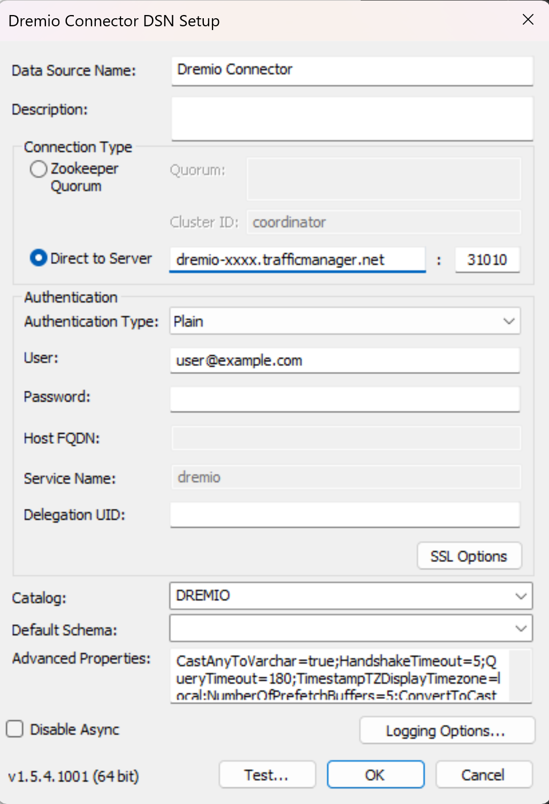

# An all-in-one data reader and tools in Python - AZDSDR

[](https://badge.fury.io/py/azdsdr)

- [An all-in-one data reader and tools in Python - AZDSDR](#an-all-in-one-data-reader-and-tools-in-python---azdsdr)
	- [Installation](#installation)
		- [Potential installation errors and solutions](#potential-installation-errors-and-solutions)
	- [Use Kusto Reader](#use-kusto-reader)
		- [Azure CLI Authentication](#azure-cli-authentication)
		- [Run any Kusto query](#run-any-kusto-query)
		- [Show Kusto tables](#show-kusto-tables)
		- [Create an empty Kusto table from a CSV file](#create-an-empty-kusto-table-from-a-csv-file)
		- [Upload data to Kusto](#upload-data-to-kusto)
	- [Use Dremimo Reader](#use-dremimo-reader)
		- [Step 1. Install Dremio Connector](#step-1-install-dremio-connector)
		- [Step 2. Generate a Personal Access Token(PAT)](#step-2-generate-a-personal-access-tokenpat)
		- [Step 3. Configure driver](#step-3-configure-driver)
		- [Dremio Sample Query](#dremio-sample-query)
	- [Move data with functions from `Pipelines` class](#move-data-with-functions-from-pipelines-class)
		- [Export Kusto data to local csv file](#export-kusto-data-to-local-csv-file)
		- [Move Dremio data to Kusto](#move-dremio-data-to-kusto)
	- [Data Tools](#data-tools)
		- [`display_all` Display all dataframe rows](#display_all-display-all-dataframe-rows)
	- [Thanks](#thanks)
	- [Update Logs](#update-logs)
		- [Jan 24, 2024](#jan-24-2024)
		- [Jan 23, 2023](#jan-23-2023)
		- [Jan 18, 2023](#jan-18-2023)
		- [Jan 17, 2023](#jan-17-2023)
		- [Jan 10, 2023](#jan-10-2023)
		- [Dec 16, 2022](#dec-16-2022)
		- [Dec 10, 2022](#dec-10-2022)
		- [Dec 6, 2022](#dec-6-2022)

This package includes data reader for DS to access data in a easy way. 

Covered data platforms:

* Kusto
* Azure Blob Storage (Samples coming soon)
* Dremio
* Microsoft Cosmos - Not Azure Cosmos DB, the Microsoft Cosmos using Scope, now AKA Azure Data Lake (Samples coming soon) 

May cover in the future:

* Databricks/Spark
* Microsoft Synapse
* Delta Lake
* Postgresql
* Microsoft SQL Server
* SQLite

Besides, the package also include functions from `Pipelines` class to help move data around: 

* Dremio to Kusto
* Kusto to CSV file

## Installation

The module is test and usable for Python 3.10 and Python 3.9. Other versions(Python 3.6+) should also works. 

Use pip to install the package and all of the dependences

```
pip install -U azdsdr
```

The `-U` will help update your old version to the newest

Or, you can clone the repository and copy over the `readers.py` file to your project folder.  

The installation will also install all the dependance packages automatrically.

* pandas
* pyodbc
* azure-cli
* azure-kusto-data
* azure-kusto-ingest
* azure-storage-blob
* matplotlib
* ipython
* ipykernel

If you are working on a new build OS, the all-in-one installation will also save you time from installing individual packages one by one. 

### Potential installation errors and solutions

Most of the time, all dependent packages should be successfully installed without any additional interfere. But you may still see error message based on different OS and Python version. 

1. Need elevated permission

	* Error message:
		```
		Error: Could not install packages due to an OSError: [Erron 13] Permission denied:...
		```
	* Solution:  
  		Start a new Windows terminal window with Administrator permission (Right click icon, and then "Run as administrator")

1. Fail to install `pyodbc`  

	Usually occurs in Linux and MacOS. 

	* Error message  
  
		```
		Building wheel for pyodbc (setup.py) ... error
		```

	* Solution  

		Linux: run this first 

		```bash
		sudo apt-get install unixodbc-dev
		```
		<https://github.com/mkleehammer/pyodbc/issues/276>

		Macos: run this first
		```bash
		brew install unixodbc
		export LDFLAGS="-L/opt/homebrew/Cellar/unixodbc/2.3.9/lib"
		export CPPFLAGS="-I/opt/homebrew/Cellar/unixodbc/2.3.9/include"
		```


## Use Kusto Reader

### Azure CLI Authentication

Before running the kusto query, please use 

```
az login
```

To login into Azure using AAD authentication. An authentication refresh token is generated by Azure and stored in your local machine. This token will be revoked after **90 days of inactivity**. 

For More details, read [Sign in with Azure CLI](https://learn.microsoft.com/en-us/cli/azure/authenticate-azure-cli).

After successufuly authenticated with AAD, you should be able to run the following code without any pop up auth request. The Kusto Reader is test in Windows 10, also works in Linux and Mac. 

### Run any Kusto query

```python 
from azdsdr.readers import KustoReader

cluster = "https://help.kusto.windows.net"
db      = "Samples"
kr      = KustoReader(cluster=cluster,db=db)

kql     = "StormEvents | take 10"
r       = kr.run_kql(kql)
```

The function `run_kql` will return a Pandas Dataframe object hold by `r`. The `kr` object will be reused in the following samples.

Use `run_kql_all` to output multiple result set. 

```python
kql = '''
StormEvents 
| take 10
;
StormEvents 
| summarize count()
'''
rs = kr.run_kql_all(kql=kql)
for r in rs:
    display(r)
```

### Show Kusto tables

List all tables:

```python
kr.list_tables()
```


List tables with folder keyword: 

```python
kr.list_tables(folder_name='Covid19')
```


### Create an empty Kusto table from a CSV file

This function can be used before uploading CSV data to Kusto table. Instead of manually creating a Kusto table from CSV schema, use this function to create a empty Kusto table based on CSV file automatically. 

Besides, you can also specify the table's folder name. 

```python
kusto_table_name  = 'target_kusto_table'
folder_name       = 'target_kusto_folder'
csv_file_name     = 'local_csv_path'
kr.create_table_from_csv (
    kusto_table_name    = kusto_table_name
    ,csv_file_path      = csv_file_name
    ,kusto_folder       = folder_name
)
```

### Upload data to Kusto

Before uploading your data to Kusto, please make sure you have the right table created to hold the data. Ideally, you can use the above `create_table_from_csv` to create an empty table for you. 

To enable the data ingestion(upload), you should also initialize the KustoReader object with an additional `ingest_cluster_str` parameter. Here is a sample, you should ask your admin or doc to find out the ingestion cluster url. 

```python
cluster         = "https://help.kusto.windows.net"
ingest_cluster  = "https://help-ingest.kusto.windows.net"
db              = "Samples"
kr              = KustoReader(cluster=cluster,db=db,ingest_cluster_str=ingest_cluster)
```

Note that you will need to create a empty table with aligned table schema to hold the data. 

You can also save the dataframe object `you_df_data` as CSV file first, and create a empty table from the csv file. 

```python
you_df_data.to_csv('temp.csv',index=False)

target_kusto_table  =  'upload_df_to_kusto_test'
kr.create_table_from_csv(
    kusto_table_name = target_kusto_table
    ,kusto_folder = 'test'
    ,csv_file_path = 'temp.csv'
)
print('create empty table done')
```

Then upload Pandas Dataframe to Kusto:

```python
target_kusto_table  = 'kusto_table_name'
df_data             = you_df_data
kr.upload_df_to_kusto(
    target_table_name = target_kusto_table
    ,df_data          = df_data
)
kr.check_table_data(target_table_name=target_kusto_table)
```

Upload CSV file to Kusto:

```python
target_kusto_table  = 'kusto_table_name'
csv_path            = 'csv_file.csv'
kr.upload_csv_to_kusto(
    target_table_name = target_kusto_table
    ,csv_path         = csv_path
)
```

Upload Azure Blob CSV file to Kusto, this is the best and fast way to upload massive csv data to Kusto table. 

```python
target_kusto_table  = 'kusto_table_name'
blob_sas_url = 'the sas url you generate from Azure portal or Azure Storage Explorer, or azdsdr'
kr.upload_csv_from_blob (
    target_table_name   = kusto_table_name
    ,blob_sas_url       = blob_sas_url
)
```

I will cover how to generate `blob_sas_url` in the Azure Blob Reader section. [TODO]

## Use Dremimo Reader

### Step 1. Install Dremio Connector

You will need to install the Dremio ODBC driver first to use `DremioReader` from this package. 

**For Windows user**

Please download the [dremio-connector](https://github.com/xhinker/azdsdr/tree/main/drivers) file from the drivers folder. 


### Step 2. Generate a [Personal Access Token(PAT)](https://docs.dremio.com/cloud/security/authentication/personal-access-token/#creating-a-token)

- Recommend storing this personal access token in a safe location, such as a user environment variable on your local machine.  
- Start Menu -> “Edit Environment variables For Your Account”.  
- Click “New” under environment variables.  
- Enter a new variable with name “DREMIO_TOKEN” and set the value to the PAT you generated earlier.  

Note: you will have to log out your Windows account and log in again to take the new env variable take effort.

### Step 3. Configure driver
- Go to Start Menu -> “ODBC Data Sources (64-bit)”.
- Under User DSN, click “Add”.
- Add Dremio Connector.
- Configure as follows:
  - set `Data Source Name` as **Dremio Connector**. 
  - with your own **user@example.com** as the username.
  - Do remember to replace the dremio host with your own host string. 



- Click Ok/Save

**For Linux and Mac User**

You can download the driver from [Dremio's ODBC Driver](https://www.dremio.com/drivers/odbc/) page. It should be working in theory, haven't been test yet. 

### Dremio Sample Query

```python
from azdsdr.readers import DremioReader
import os

username    = "name@host.com"
#token       = "token string"
token       = os.environ.get("DREMIO_TOKEN") 
dr          = DremioReader(username=username,token=token)

sql = '''
select 
    * 
from 
    [workspace].[folder].[tablename]
limit 10
'''
r = dr.run_sql(sql)
```

## Move data with functions from `Pipelines` class

### Export Kusto data to local csv file

[TODO]

When the export data is very large like exceed 1 billion rows, kusto will export data to several csv files. this function will automatically combine the data to one single CSV file in destination folder.

### Move Dremio data to Kusto 

[TODO]

## Data Tools

### `display_all` Display all dataframe rows

The IPython's `display` can display only limited rows of data. This tool can display **all** or **specified rows** of data. 

```python
from azdsdr.tools import pd_tools
display_all = pd_tools().display_all

#...prepare pd data

# display all 
display_all(pd_data)

# display top 20 rows
display_all(pd_data,top=20)
```

## Thanks

The Dremio ODBC Reader solution is origin from [KC Munnings](https://github.com/kcm117). Glory and credits belong to KC. 

--- 

## Update Logs

### Jan 24, 2024

* Add `bar1_chart` in `vis_tools`, so that you can plot bar chart using `vis_tools` class.

### Jan 23, 2023

* Add `Grid` and `XY Axes Lable` option for 1 line and 2 lines chart.

### Jan 18, 2023

* Add walk-around and solutions to potential installation errors. 

### Jan 17, 2023

* Add `show_data_label` option for `vis_tools`'s `line1_chart` function. 
If specify the `show_data_label=True`, the chart will show each data point's value. 

### Jan 10, 2023

* Add guid to the temp cosmos script file and temp middle stream file to avoid temp files collision. 

### Dec 16, 2022

* Add function `get_table_schema` for `KustoReader`
* Add function `get_table_folder` for `KustoReader`

### Dec 10, 2022

* Update Dremio Reader configuration document and screenshot.

### Dec 6, 2022

* Add function `download_file_list` of class `AzureBlobReader` to download a list of CSV file with the same schema and merge to one target CSV file.
* Add function `delete_blob_files` of class `AzureBlobReader` to delete a list of blob files.
* Add [usage sample code](https://github.com/xhinker/azdsdr/tree/main/usage_examples). 